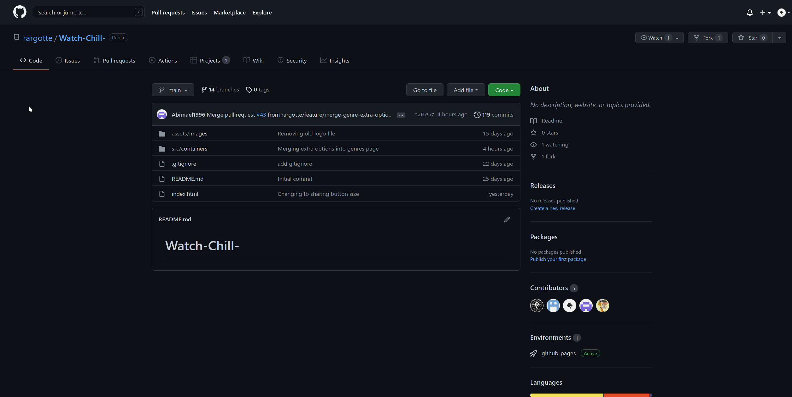
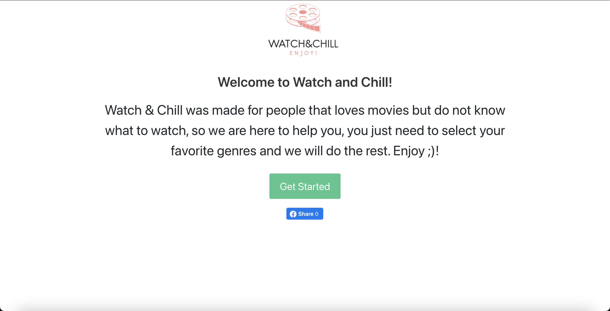

# Watch&Chill Web Application

## Description
This project was requested by our customer, the customer stated that they needed an app that was able to:

Recommend movies to the user according to the genres and years that the user wishes to see.

---
## Our motivation

When we feel like watching a movie, we nowadays have an incredible number of options easily available to us, to the point it becomes overwhelming. like everything in life, the more options we have, the most difficult is to choose from. 

As developers, this motivated us to write the following user story:

---
## Table of Contents

in the following. we will leave links to help reader find what is the most important for them to read. instead of taking more time from the reader.

-[Installation](#Installation)

-[Process](#Process)

-[How to Contribute](#How_To_Contribute) 

-[What is Next](#What_is_Next)

-[Task and Roles](#Task&Roles)

-[Credits](#Credits)

-[Links](#Links)

-[License](#License)

---
## Installation

to run this project successfuly one needs to go to Github specifically to this link. https://github.com/rargotte/Watch-Chill- click on the link and you will be taken to Watch&Chill Github page, where the user will be available to see the code. 

Here is a picture of the github account. 

Here is a picture of the Proyect on Github pages.

---
## Process
This are the programms and third-party assets that we used through out the proyect.

- Bulma
- HTML
- JavaScript
- JQuery
- FontAwesome

### API
- TheMovieDB
- FacebookDevelopers

---
## Contribute
we recommend the users to let us know if they find any bugs to please create a ticket in our Github account.

[Create a ticket](https://github.com/rargotte/Watch-Chill-/issues)

---
## What is next?
What the Staff for Watch&Chill plan for the platform are
- Share movies results in FB.
- Share selected movie on Twitter.
- Include more extra option on the platform.
- Build a mobile application.

---
## Task&Roles

### Home Page
- Salvador Espinosa

### Genres Page
- Abimael Monárrez

### Extra Options Page
- Guillermo Lazo
- Salvador Espinosa

### Search Results Page
- Regulo Argotte

### Movie Modal
- Adrián Fernández
- Guillermo Lazo

---
## Credits
This are the team members, for the proyect Watch&Chill:

- Guillermo Lazo

- Regulo Argotte

- Abimael Monárrez

- Adrián Fernández

- Salvador Espinosa

---
## Links

Deployed Proyect: https://rargotte.github.io/Watch-Chill-/

GitHub repo: https://github.com/rargotte/Watch-Chill-

# License

This file is only operated by personal that were contacted by the employer. We clarify that the employer is the only person that owns the right for the proyect Watch&Chill.

